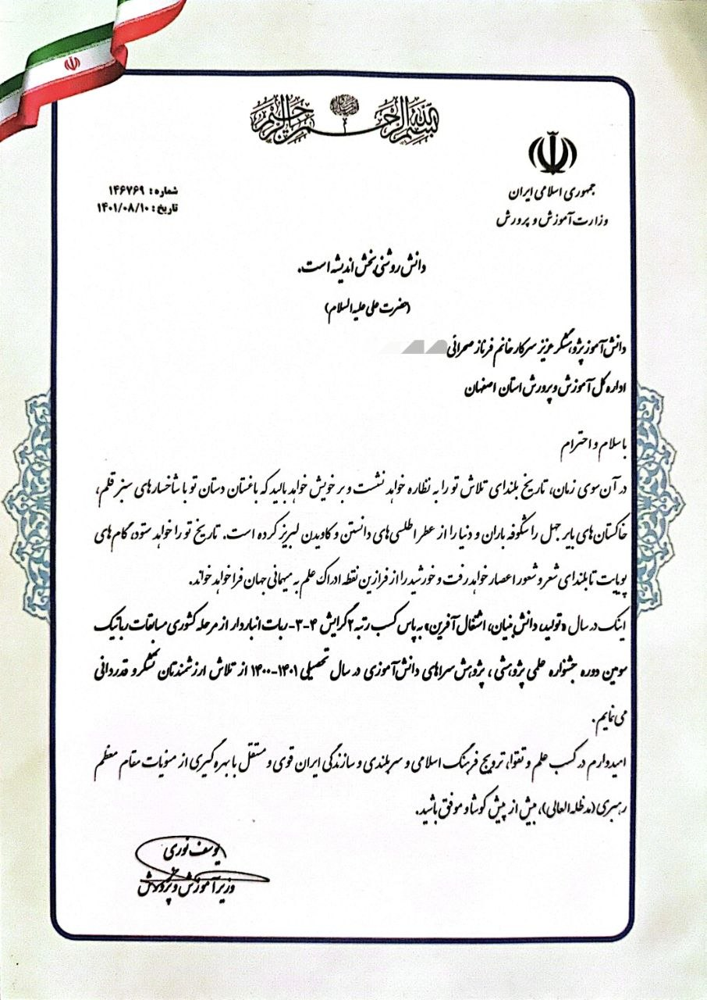
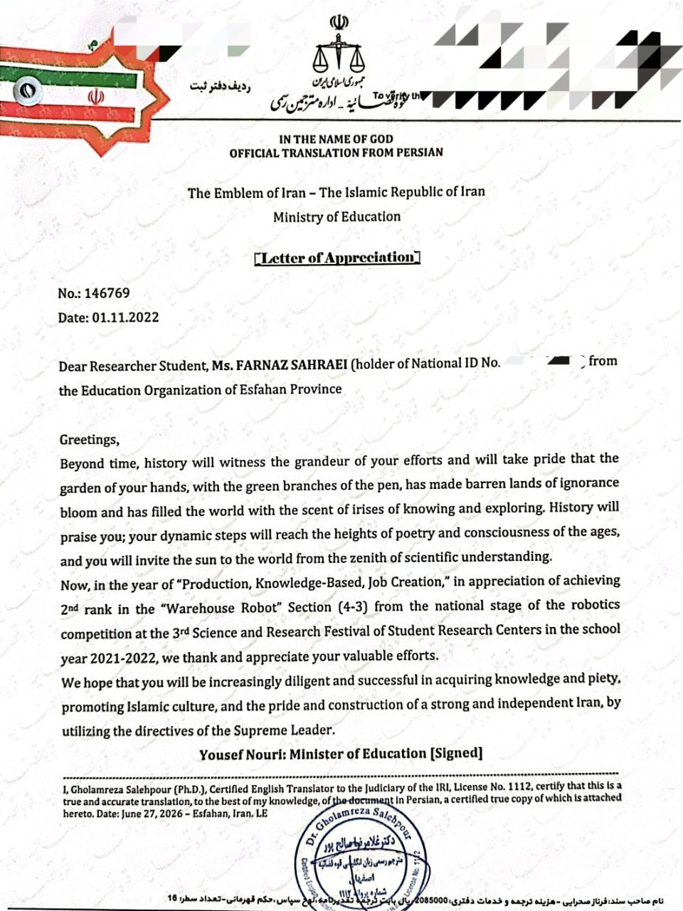
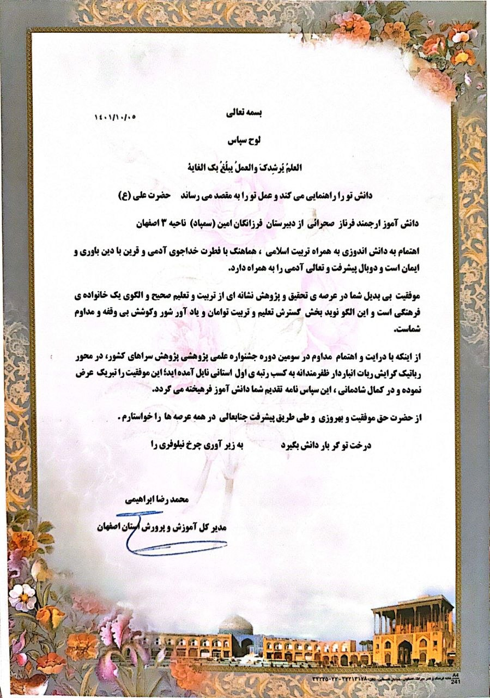
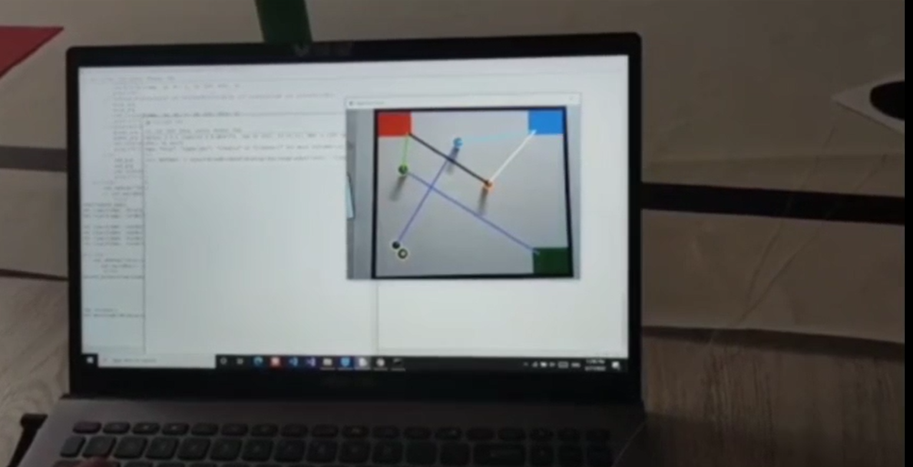
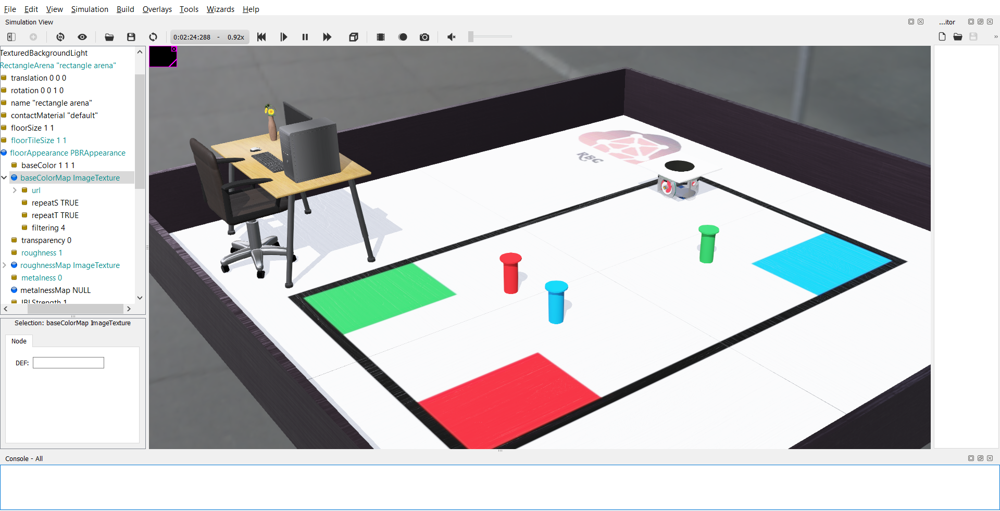
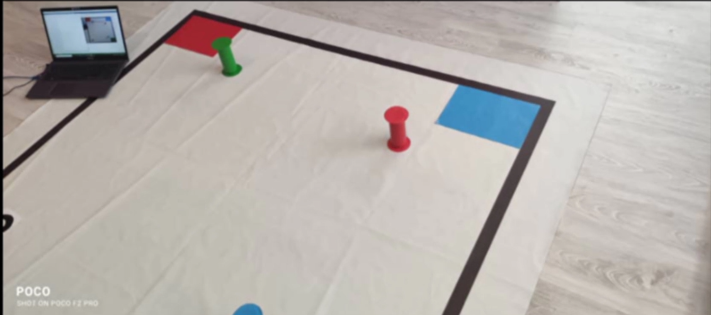
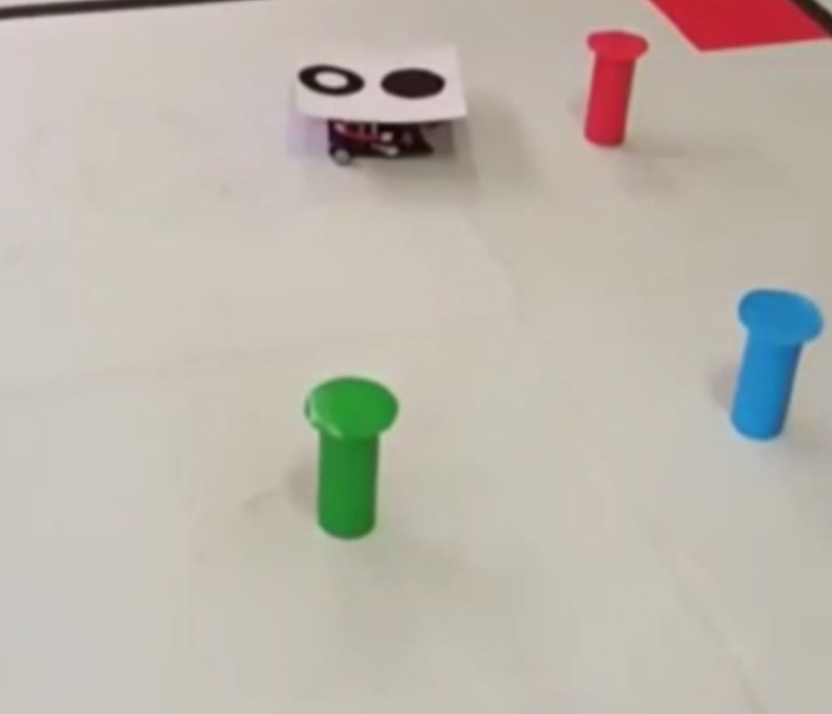
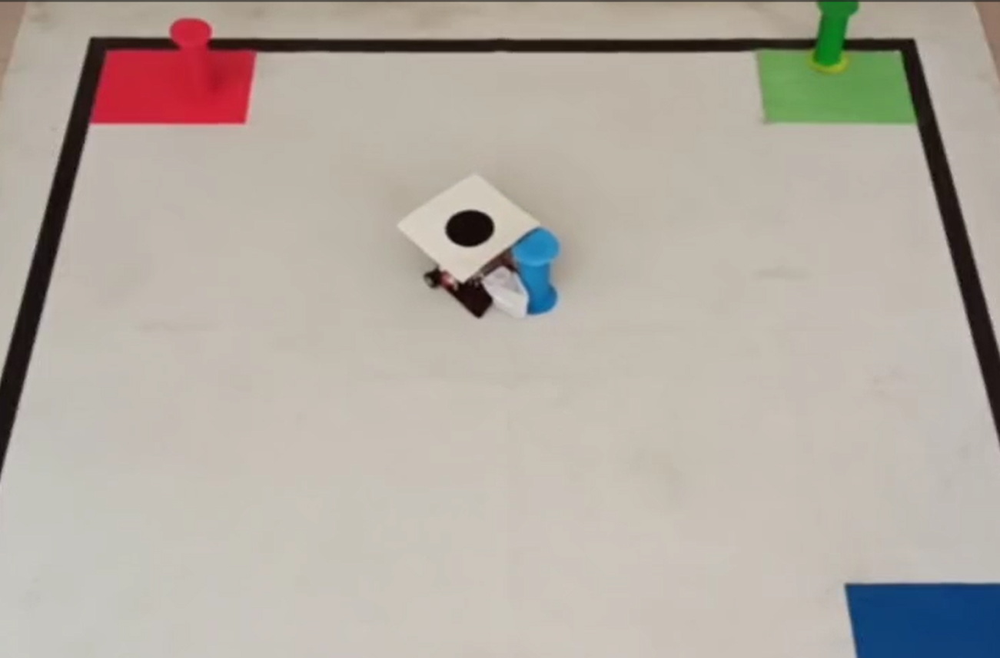

# Autonomous Warehouse Robot

## Overview

This project is an autonomous warehouse robot developed for the Student Research Centers National Competition.

The main objective of this project was to design and implement a robotic platform capable of performing warehouse automation tasks through computer vision, autonomous navigation, and embedded control systems.

The robot integrates image processing algorithms, real-time decision making, and hardware control to detect objects, navigate through the environment, and perform autonomous operations.

---

# Competition Achievements

🏆 **1st Place - Provincial Level**

🥈 **2nd Place - National Level**

🏅 **Certificate of Appreciation from the Minister of Education**

This project participated in the Student Research Centers National Competition and achieved outstanding results at both provincial and national levels.

The achievement recognized the design, implementation, and innovative aspects of the autonomous warehouse robotic system.

---

# Project Information

- **Competition:** Student Research Centers National Competition
- **Rank:** 1st Provincial / 2nd National
- **Project Type:** Autonomous Mobile Robot
- **Application:** Warehouse Automation

---

# System Overview

The robot system consists of several main components:

## 1. Perception Layer

Responsible for understanding the environment.

Features:

- Image acquisition
- Object detection
- Image processing algorithms
- Environmental analysis

Technologies:

- Python
- OpenCV
- NumPy

---

## 2. Decision & Control Layer

Responsible for autonomous robot behavior.

Features:

- Processing sensor information
- Generating movement commands
- Task execution logic
- Real-time decision making

---

## 3. Hardware Control Layer

Responsible for communication with robot hardware.

Features:

- Motor control
- Embedded programming
- Low-level hardware interaction
- Real-time execution

---

# Hardware Platform

## Main Components

- Embedded controller
- Motor driver modules
- DC motors
- Sensors
- Robotic chassis

---

# Software Features

## Computer Vision System

The robot uses computer vision techniques for:

- Object detection
- Image processing
- Environment understanding
- Target identification

---

## Autonomous Navigation

Implemented capabilities:

- Robot movement control
- Path following
- Navigation decision making
- Obstacle handling

---

## Embedded Control

The embedded system provides:

- Motor control
- Real-time communication
- Hardware abstraction
- Robot motion execution

---

# Technologies

- Python
- OpenCV
- NumPy
- Embedded C
- bluetooth
- Robotics Programming
- Computer Vision
- Autonomous Systems
- Image Processing

---

# Project Architecture

             Camera / Sensors

                   |
                   |

          Computer Vision Module

                   |
                   |

          Decision Making System

                   |
                       bluetooth
                   |

          Robot Control System 

                   |
                   |

          Motors & Hardware

          

---

# Engineering Challenges

During development, the main challenges included:

- Designing reliable object detection algorithms
- Processing visual data in real time
- Integrating software and hardware components
- Creating stable robot movement control
- Managing computational limitations

---

# Project Images

---

# Demo

(Add project demonstration video)

[▶ Watch Demo Video](videos/robot_film.mp4)

# Documentation

The complete project proposal and technical documentation are available below:

📄 [Project Proposal](docs/proposal-en.pdf)

# Learning Outcomes

This project provided practical experience in:

- Autonomous robotics
- Computer vision applications
- Embedded systems
- Hardware-software integration
- Real-time robotic control
- Industrial automation concepts

---

# Author

Developed as an award-winning robotics project for the Student Research Centers National Competition.

This project represents practical experience in autonomous systems, computer vision, and robotic automation.
